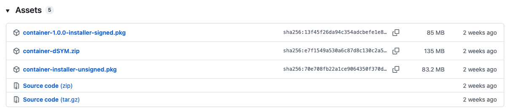

# 學生程式碼空間（Apple container 版）

此目錄是 `student-workspace/` 的獨立副本，改用 Apple 官方 `container` CLI 執行，不依賴 Docker Desktop。原 Docker 專案不受影響，兩個專案的 `data/`、帳號資料庫與學生檔案彼此獨立。

Apple container 會為每個 Linux 容器建立輕量虛擬機，支援 Dockerfile／Containerfile 映像建置、主機資料夾掛載、連接埠發布，以及 CPU 與記憶體限制。

## 系統需求

- Apple silicon Mac。
- macOS 26 或相容版本。
- Apple `container` CLI 1.0.0 以上。

下載：
至Apple官方Github下載Release version: [Apple/container](https://github.com/apple/container)

右側下方有Release tag，可以直接進入`Latest version`，滑到最下面的Assets下載`.pkg`



確認安裝：

```bash
container --version
container system status
```

## 建立 data 資料夾

`data/` 與 `.env` 均包含敏感資料，已由根目錄 `.gitignore` 排除。第一次使用時執行：

```bash
cd student-workspace-container
mkdir -p data/storage
chmod 700 data data/storage
```

資料結構：

```text
data/
├── accounts.db                 # 首次啟動後自動建立
├── student-accounts.csv        # 選用的教師帳密清單
└── storage/
    ├── ProgramDesign01/
    ├── ProgramDesign02/
    ├── ...
    └── ProgramDesign50/
```

## 建置與啟動

```bash
cd student-workspace-container
./container-start.sh
```

第一次執行會：

1. 啟動 Apple container 系統服務。
2. 建立不提交到 Git 的 `.env`。
3. 使用 `Containerfile` 建置 `student-workspace-apple:local` 映像。
4. 停止建置用的 builder VM，釋放其 CPU 與記憶體。
5. 掛載此專案的 `data/` 到容器 `/data`。
6. 啟動 `student-workspace-apple`。

一般啟動會依本機 `.image-built` 標記重用既有映像。修改程式碼、模板或相依套件，或手動刪除映像後，使用以下指令強制重建：

```bash
./container-start.sh --build
```

預設網址：

```text
http://127.0.0.1:5002
```

區域網路設備使用教師 Mac 的 IP，例如：

```text
http://192.168.50.1:5002
```

若要只綁定指定有線網卡，在 `.env` 設定：

```dotenv
STUDENT_WORKSPACE_BIND_IP=192.168.50.1
STUDENT_WORKSPACE_PORT=5002
```

## 帳號管理

目前本機副本已沿用原 `student-workspace/data/accounts.db` 中的 `ProgramDesign01`～`ProgramDesign50` 帳號與密碼。敏感資料只存在本機 `data/`，不會提交到 Git。

無論 Apple container 是否啟動，都可建立新的單一學生帳號：

```bash
./manage.sh create-user s001 王小明 class2026
```

參數依序為「帳號、顯示名稱、密碼」，密碼至少需要 8 個字元。例如：

```bash
./manage.sh create-user ProgramDesign51 學生51 A7m9K2p4Qx
```

查詢帳號與儲存路徑：

```bash
./manage.sh list-users
./manage.sh student-path s001
```

程式只在 `accounts.db` 儲存密碼雜湊，不會保存可還原的明文密碼。若自行批次建立隨機密碼，必須另外將教師用帳密清單保存在 `data/student-accounts.csv`，且不得提交到 Git。

`manage.sh` 直接管理主機掛載的 `data/`，不依賴目前在 Apple container 1.0.0 上較不穩定的 `container exec`。

## 狀態、紀錄與停止

```bash
container list --all
container logs student-workspace-apple
container stats student-workspace-apple
./container-stop.sh
```

停止或刪除 Apple container 不會刪除主機上的 `data/`。

## 安全設定

啟動腳本套用以下限制：

- 非 root UID／GID。
- 唯讀容器根檔案系統。
- 僅 `data/` 與 `/tmp` 可寫入。
- 移除所有額外 Linux capabilities。
- 1 CPU、512 MB 記憶體。
- 最多 128 個程序。
- 不掛載 Docker socket、家目錄、桌面或文件資料夾。

目前容器只提供登入、檔案上傳、預覽與下載，不會執行學生程式碼。

## 測試

```bash
$HOME/.venv/flask/bin/python -m unittest discover -s tests -v
```

Apple container 官方文件：[How-to](https://github.com/apple/container/blob/main/docs/how-to.md)、[Tutorial](https://github.com/apple/container/blob/main/docs/tutorial.md)。
